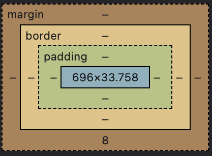

# HTML & CSS Basics

In this lesson you'll explore how websites are made, starting with just a blank file and some text. You'll experiment directly with HTML & CSS, the languages behind everything you see on the web.

## Text on a Page

HTML starts simple. You can generate a basic web page by creating an `.html` file on your computer, typing `Hello, world!`, and opening that file with a web browser. Let's quickly simulate that process in the sandbox below:

```html
Hello, world!
```

{: .repl }

The browser will show exactly that. No styling. No structure. Just text.

## What Does "HTML" Mean?

HTML stands for **HyperText Markup Language**.

Let’s break that down:

- **HyperText** means text that contains links, so you can click to jump to another page or place.
- **Markup** means adding extra information around your content to tell the computer what it is or how it should be shown.

## Why "markup"?

The word **markup** comes from the world of print publishing, where editors and printers would literally mark up manuscripts with instructions like "make this bold" or "this is a heading." HTML works the same way, you're marking up plain text with tags like `<h1>`, `<p>`, or `<a>` to give it meaning and structure.

Like editors marking up manuscripts, HTML tags give meaning to parts of your text.

### A Bit of History

HTML was created by Tim Berners-Lee to help scientists share documents, not to make flashy sites.

That’s why tags like `<h1>` or `<blockquote>` exist: to describe the structure of a page, not its look.

For example:

- `<h1>` means "this is a main heading"
- `<blockquote>` means "this is a quote"
- `<cite>` means "this is a source"

So, when you write HTML, you’re not just making things _appear_, you’re _describing_ what they are.

## HTML Element Breakdown

An HTML element usually has:

- An opening tag, like `<p>` or `<h1>`
- Some content, like `Hello!`
- A closing tag (indicated by slash `/`), like `</p>` or `</h1>`

```html
<h1>Hello!</h1>
```

Here’s an example:

```html
<p>This is a paragraph.</p>
```

{: .repl }

There’s an **opening tag**, `<p>`, **content** `This is a paragraph.`, and a **closing tag**, `</p>`.

### HTML Attributes

HTML elements have "attributes" that provide additional information about the element. Attributes usually come in name/value pairs like `name="value"`.

<aside class="tip">
  Attributes are always specified in the opening tag.
</aside>

## Create a link

HTML is all about linking. You can create one using the `<a>` tag, short for "anchor", with some attributes:

```html
<a href="https://youtu.be/Aq5WXmQQooo" target="_blank">Click me! 😎</a>
```

{: .repl }

- The `href` _attribute_ with a _value_ `https://youtu.be/Aq5WXmQQooo` tells the browser where to go.
- The `target` _attribute_ with a _value_ `_blank` tells the browser to open this link in a new tab.
- The text between the tags `Click me! 😎` is what the user clicks.

<aside class="tip">
  🛠️ Try this: Change the link to your favorite website.
</aside>

## Changing Style with One Attribute

We just learned the basics of HTML. HTML structures your content.
Now let's add some style! CSS is the language that styles your content.

Let's start by adding some simple CSS using the style attribute:

```html
<p style="color: red;">Red text</p>
```

{: .repl }

This tells the browser to display the text in red.

<aside class="warning">
  When we use the <code>style</code> attribute directly on an HTML element, that's called using inline styles. 'Inline styles' work, but are generally considered a "code smell" (like food that is still edible, but somethings's off). It’s better to use CSS style rules. (We'll show you how soon)
</aside>

## Using `<span>` to Style Part of a Sentence

What if you want to style just one word inside a paragraph? Use `<span>`. It’s an inline tag, meaning it doesn’t break the line.

```html
<p>
  span is great for <span style="color: green;">styling</span> small parts of
  text inline.
</p>
```

{: .repl }

<aside class="tip">
  🛠️ Try this: Style two different words with different colors.
</aside>

## CSS

Cascading Syle Sheets (CSS) is made up of several key parts. Here's a breakdown using this example:

```css
p {
  color: blue;
}
```

Parts of a CSS Rule:

### 1. Selector

```css
p
```

Targets the HTML element(s) you want to style. In this case, it targets all `<p>` (paragraph) elements.

### 2. Declaration Block

```css
 {
  color: blue;
}
```

Contains one or more declarations wrapped in curly braces `{}`.

### 3. Declaration

```css
color: blue;
```

A single style rule applied to the selected element. Each declaration ends with a semicolon `;`.

Each declaration has two parts:

#### a. Property

```css
color
```

The style aspect you want to change (e.g., `color`, `font-size`, `margin`).

#### b. Value

```css
blue
```

The setting you want to apply to the property.

### Breakdown

| Part              | Example            |
| ----------------- | ------------------ |
| Selector          | `p`                |
| Declaration Block | `{ color: blue; }` |
| Declaration       | `color: blue;`     |
| Property          | `color`            |
| Value             | `blue`             |

This format is consistent across CSS, whether you're styling tags, classes, or IDs.

## How to Show an Image

To add an image, use the `` tag (short for "image"). It’s a **self-closing tag** (no closing `</img>` needed).

```html

```

{: .repl }

- `src`, the file path (or url)
- `alt`, alternative text (shown if the image can’t load)

<aside class="tip">
  Screen readers also use <code>alt</code> to describe the image for visually impaired users.
</aside>

<aside class="tip">
  🛠️ Try this: change the <code>src</code> attribute to a different http.cat
</aside>

## Comments: Talk to Humans, Not Computers

Sometimes, you want to leave notes in your HTML that the browser won’t show. That’s what <strong>comments</strong> are for.

To write a comment in HTML, wrap your note like this:

```html
<!-- This is a comment -->
<p>This is visible text</p>
```

{: .repl }

The browser hides anything inside `<!--` and `-->`.

<aside class="tip">
  Comments are helpful for:
  <ul>
    <li>Leaving reminders for yourself</li>
    <li>Explaining tricky code</li>
    <li>Temporarily disabling parts of a page</li>
  </ul>
</aside>

## How HTML Elements Fit Together

HTML is hierarchical, like a family tree. Tags can go inside other tags. We often describe the relationship between elements as parent, child, and/or sibling.

```html
<div>
  <!-- grandparent -->
  <p>
    <!-- parent -->
    <span>Hello!</span>
    <!-- child -->
  </p>
</div>
```

{: .repl }

When tags go inside other tags we call this 'nesting'.

<aside class="tip">
  🛠️ Try this: Nest an <code>img</code> inside a <code>div</code> and a <code>p</code> inside the same <code>div</code>.
</aside>

## Extra Spaces Are Ignored

HTML doesn't care about how many spaces or line breaks you add.

```html
<p>This is a test.</p>
```

{: .repl }

The browser just shows `This is a test.` ignoring whitespace and newlines.

## How Pages Are Laid Out

HTML gives your page structure. CSS decides how things look and where they go. Together, they build the layout.

### The Default Layout: Flow

By default, HTML elements follow a top-to-bottom flow. Block-level tags (like `<div>`, `<p>`, `<h1>`) stack vertically. Inline tags (like `<span>`, `<a>`) sit next to each other in a row.

### What a `div` Is For

`<div>` stands for division. It’s a box that holds other elements. It doesn’t show anything by itself, but it helps group things:

```html
<div>
  <p>Inside the box!</p>
</div>
```

{: .repl }

It’s invisible unless you style it, but super useful for grouping content.

## Adding Borders and Rounded Corners

Want to make a box stand out? Add a border with the style attribute:

```html
<div style="border: 1px solid black;">Hello</div>
```

{: .repl }

<aside class="tip">
  Make the corners round with a border radius. Change the style attribute to <code>"border: 1px solid black; border-radius: 10px;"</code>
</aside>

These are just a few (of many) CSS properties you can use to style elements.

## Aligning Text Left, Center, or Right

Use `text-align` to move text:

```html
<p style="text-align: center;">Centered text</p>
```

{: .repl }

<aside class="tip">
  🛠️ Try this: Move text to `left`, `center`, or `right`.
</aside>

## Understanding the Box Around Elements

Every element in HTML is treated like a box. This is called the box model.



- **Content**: The actual text or image (shown in blue above)
- **Padding**: Space inside the box
- **Border**: The edge of the box
- **Margin**: Space outside the box

## How to Write CSS Style Rules

Instead of putting styles in the tag (inline), you can write them separately:

```html
<style>
  p {
    color: blue;
  }
</style>

This text remains black.

<p>This text is now blue.</p>
```

{: .repl }

This turns all text in a `<p>` tag blue.

<aside class="tip">
  Decoupling your html from your css style rules is generally considered a best practice.
</aside>

## Choosing What to Style with CSS

CSS selectors are used to "find" (or select) the HTML elements you want to style. The most basic selectors select elements based on name, id, or class. [W3](https://www.w3schools.com/css/css_selectors.asp)

Here are some examples:

```html
<style>
  /*
     Element Selector:

     This selector targets all paragraph elements <p>
  */
  p {
    color: red;
  }

  /*
     ID Selector:

     This selector targets an element with id="main"
  */
  #main {
    font-size: 20px;
  }

  /*
    Class Selector:

    This selector targets all elements with class="box"
  */
  .box {
    border: 1px solid;
  }
</style>

<div id="main" class="box">
  <p>CSS Selectors are fun!</p>
</div>
```

{: .repl}

## Making Layouts with Flexbox

Flexbox is a layout tool that helps you arrange boxes in rows or columns.

```html
<div style="display: flex;">
  <div style="border: 2px solid black">One</div>
  <div style="border: 2px solid red">Two</div>
</div>
```

{: .repl }

Note how the boxes sit next to each other instead of stacking.

### Moving Items Side to Side

Use `justify-content` to control horizontal space (left, right, or center).

```html
<div style="display: flex; justify-content: center;">
  <div>Centered</div>
</div>
```

{: .repl }

Other options:

- `center`
- `space-around`
- `flex-start`
- `flex-end`

### Lining Items Up Top to Bottom

Use `align-items` to control vertical alignment.

```html
<div style="display: flex; align-items: center;">
  <h1>Heading</h1>
  <p>with a paragraph vertically aligned</p>
</div>
```

{: .repl }

This is helpful when boxes have different heights.

## Recap

Now you know:

- ✅ How to structure content with HTML
- ✅ How to style with CSS
- ✅ How to layout elements using Flexbox

You're on your way to building real web pages!

## Scrimba's HTML & CSS Course

Sign up for a [Scrimba](https://scrimba.com) account and work through [HTML & CSS Crash Course](https://scrimba.com/html-css-crash-course-c02l). This is a **free course** so you don't need to pay for a membership.

## Extra Practice

Here are some fun games to practice your HTML and CSS skills:

- [CSS Diner](https://flukeout.github.io/)
- [Flexbox Froggy](https://flexboxfroggy.com/)
- [Grid Garden](https://cssgridgarden.com/)
- [Flexbox Zombies](https://flexboxzombies.com/)
